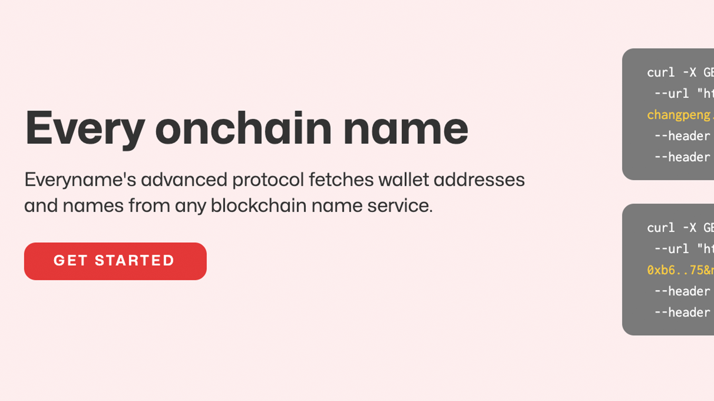

# Resolve identities in your app built with XMTP

When you build with XMTP, there’s no cold start for your app and your users. As soon as your app plugs into the XMTP network, it's able to reach today’s most popular and meaningful identities.

<!--truncate-->

XMTP’s interoperability and composability help ensure that the network can continue to grow and bring messaging to every identity—via your app.

In this context, **identity** refers to:

- Wallet addresses, such as raw 0x addresses like `0x4b70d04124c2996De29e0caa050A49822Faec6Cc`
- Human-readable domain names associated with wallet addresses. These domain names are provided by name services, such as Ethereum Name Service (ENS) and Unstoppable Domains (UNS).

As a UX best practice, build your app to enable a user to enter a domain name in the To field and have it resolve to its associated raw wallet address.

For example, a user should be able to enter `prxshant.eth` in your To field and have your app forward-resolve and display its associated wallet address `0x4b70d04124c2996De29e0caa050A49822Faec6Cc`.


And certainly, your app should also be able to accept a raw wallet address and reverse-resolve and display the associated domain name, if available.

## Resolve identities using the Everyname API

To resolve identities in your app, consider using [Everyname](https://www.everyname.xyz/), which provides forward and reverse identity resolution for many name services.

### Forward resolution using Everyname

For forward resolution, send a GET request with a domain name, or handle. For example:

```jsx
import {} from "dotenv/config";
import axios from "axios";

const handle = "fabri.lens";
let config = {
  method: "get",
  maxBodyLength: Infinity,
  url: `https://api.everyname.xyz/forward?domain=${handle}`,
  headers: {
    Accept: "application/json",
    "api-key": process.env.EVERYNAME_KEY,
  },
};
axios
  .request(config)
  .then((response) => {
    console.log(response.data);
  })
  .catch((error) => {
    console.log(error);
  });
```

The response provides the associated wallet address. For example:

```jsx
{
  success: true,
  address: '0x7E0b0363404751346930AF92C80D1fef932Cc48a',
  tldUrl: 'https://lens.xyz',
  tld: '.lens'
}
```

### Reverse resolution using Everyname

For reverse resolution, send a GET request with a wallet address and network. For example:

```jsx
import {} from "dotenv/config";
import axios from "axios";

const axios = require("axios");
let config = {
  method: "get",
  maxBodyLength: Infinity,
  url: "https://api.everyname.xyz/reverse?address=0x7E0b0363404751346930AF92C80D1fef932Cc48a&network=lens",
  headers: {
    Accept: "application/json",
    "api-key": "process.env.EVERYNAME_KEY",
  },
};
axios
  .request(config)
  .then((response) => {
    console.log(JSON.stringify(response.data));
  })
  .catch((error) => {
    console.log(error);
  });
```

The response provides the associated domain name, if available. For example:

```jsx
{
  "success": true,
  "provider": "lens",
  "tldUrl": "https://lens.xyz",
  "name": "fabri.lens"
}
```

To learn more about Everyname, see [Introduction](https://docs.everyname.xyz/api/introduction).

To learn about wallet addresses and chains that are compatible with XMTP, see [Chains](/docs/concepts/works-with-xmtp#chains).

To learn about name services, or decentralized IDs, that work with XMTP, see [Decentralized identifiers](/docs/concepts/works-with-xmtp#decentralized-identifiers).
