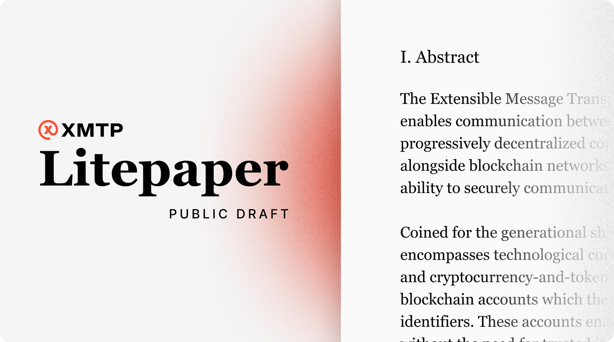

A primer on XMTP—the secure web3 messaging protocol—why we're building it, how it works, and where we see it going in the future.

<!--truncate-->

I'm excited to release an initial draft version of the [XMTP Litepaper](https://github.com/xmtp/litepaper#readme) for public release today. It's a primer on what we dubbed the Extensible Message Transport Protocol (XMTP)—giving an overview of why we're building it, how it works, and where we see it going in the future.

When we set out to build XMTP, we envisioned a means of communication where users owned their identity and data. It would need to be easy to use, privacy-preserving, permissionless, decentralized, and resistant to abuse. This has proven no small feat to accomplish, but we believe the mission is worth pursuing.

With our ambitious goal in mind, we've been lucky to assemble a group of phenomenally talented people at XMTP Labs—a team that's no doubt up for the challenges that lie ahead. And today, we're opening up more around our work—past, present, and future.

We quietly launched XMTP months ago, and have thus far been primarily focused on working with developers to bring secure web3 messaging to their apps and experiences. It's been awesome to see all of the [different use cases](https://blog.xmtp.com/hack-fs-award-wrap/) and ways they're [implementing it already](https://blog.xmtp.com/project-spotlight-relay-receiver/), but this story has [just barely begun](https://blog.xmtp.com/truths-not-spoofs/), and it's time to start telling more of it.

Over the coming weeks and months, we'll be sharing in-depth explorations of the ideas put forth in the Litepaper—our motivations, learnings, and progress in building XMTP thus far. This document is still very much a draft, with some sections in an incomplete state, to be filled in as our research continues, but we feel it's time to take the project to the public for discussion.

So in the meantime, while we continue to build, we invite you to:

* Read the [XMTP Litepaper](https://github.com/xmtp/litepaper)
* Discuss it with us on [Twitter](https://twitter.com/xmtp_), [Discord](https://discord.gg/xmtp), and [GitHub Discussions](https://github.com/orgs/xmtp/discussions)
* Check out the [XMTP Docs](https://xmtp.org/docs) to get started building
