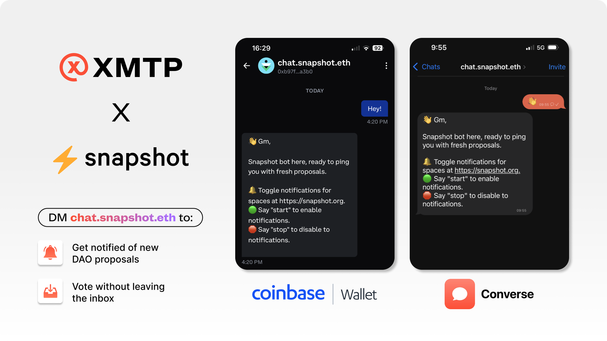

With Snapshot integrating XMTP, DAOs can reach blockchain addresses directly to notify and engage voters, hold delegates accountable, and verify authenticity while preserving privacy.

:::info Get the latest doc
DM **chat.snapshot.eth** to start receiving notifications from the DAOs you are a part of, straight to your blockchain address on Coinbase Wallet, Lenster, Converse or any other [XMTP client app](https://xmtp.chat).
:::

Trustless systems don’t remove the need for us to communicate with each other. If anything, removing trusted third parties makes it that much more crucial for us to have secure ways to communicate, while being able to verify who we’re talking to.

The transparency, security and permissionlessness of blockchain has been missing from our communication in web3. This leads to a lack of critical engagement, which is especially felt when we try to organize ourselves as a group and make decisions democratically. For example, on average only [20% of people vote](https://medium.com/@fydetreasury/the-dao-governance-conundrum-part-ii-e375c240b76a) in Decentralized Autonomous Organizations (DAO).

DAOs are about decentralizing ownership of a platform, and giving members (usually established through on-chain ownership) a say in decisions about its future. But to reach users, DAOs have to make use of web2 messaging platforms, which is truly problematic for preserving anonymity and privacy in voting. To reach is to dox.

**_With XMTP, Snapshot is making it dead simple for DAOs to notify members without collecting personal information, and allow them to vote without leaving the app._**

This is crucial when we consider the fact that web2 platforms have access to personal data, and sometimes ban users without giving a reason. They also provide no secure way to verify the on-chain identity of who we’re talking to, which only creates mistrust as more scams take place.

It’s amazing how much DAOs have been able to accomplish already, but if you ask any DAO organizer they will tell you it’s been a struggle: to coordinate at scale; to get members to vote; to receive feedback and understand the community; and to hold delegates accountable.

Secure communication between blockchain addresses, received on apps we already use and trust like Coinbase Wallet, Lens apps, or Converse, is the major unlock that will empower the entire ecosystem to coordinate and build more effectively.
