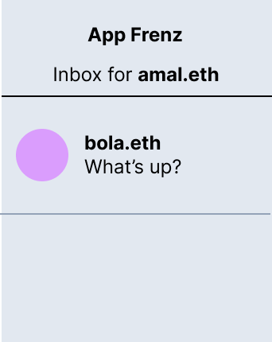
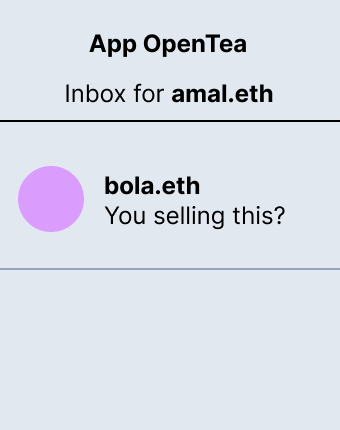
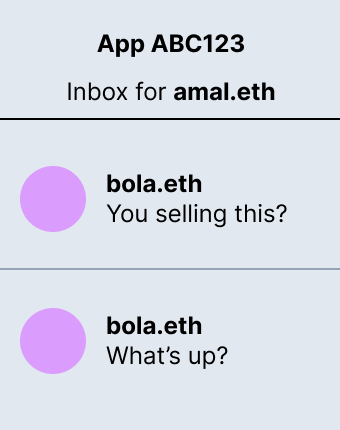

# Use labels to differentiate multiple conversations between a pair of addresses

With XMTP, a pair of blockchain account addresses can have multiple ongoing conversations. In addition, with XMTP, an app can display all conversations a user has, regardless of the app they used to create the conversation. This concept is known as an [interoperable inbox](/docs/concepts/interoperable-inbox).

Alternatively, an app can implement conversation IDs and metadata to [filter conversations](filter-conversations). For example, a developer can choose to assign app-specific conversation IDs and metadata to filter and display only conversations created by their app.

Apps that assign conversation IDs in this way have an effect on apps that use an interoperable inbox model. For example, a user might see multiple separate and ongoing conversations they are having with the same address, but originating from contexts with different conversation IDs.

If you're using an interoperable inbox model in your app, you can display conversation labels based on conversation IDs and metadata to help clarify the user experience.

:::tip

When providing an interoperable inbox, display only one conversation per address pair and conversation ID combination. This ensures that the two addresses exchange messages using the same conversation topic.

:::

To illustrate this scenario, let's take a look at a couple of conversations between `amal.eth` and `bola.eth`.

`amal.eth` and `bola.eth` have an ongoing conversation using apps that filter conversations to display only conversations that use a `conversationId` of `lens.dev/dm`. Here's what `amal.eth`'s inbox might look like in one of these apps:



`amal.eth` and `bola.eth` also have a separate and ongoing conversation using App OpenTea that filters conversations to display only conversations that use a `conversationId` of `opentea.xyz/nft`. Here's what `amal.eth`'s inbox might look like in this app:



Let's then take a look at App ABC123, which doesn't filter by conversation ID and displays all conversations for a user. In this case, here's what `amal.eth`'s inbox might look like in this app:



This scenario may display a confusing user experience for `amal.eth`, surfacing two separate conversations they are having with the same address, `bola.eth`.

To help distinguish the multiple conversations `amal.eth` is having with the same address, you can implement labels, based on conversation IDs and metadata, that display for each conversation.


<!--source figma: https://www.figma.com/file/CLbhKAxtqVGHg5dzlTZDDT/conversation-id-tagging?node-id=0%3A1&t=SsLx2y6TrDheLdU3-1-->

**To use labels to differentiate multiple conversations between a pair of addresses:**

Get the `conversationId` value to display as a label.

For example:

```js
// To get the conversationId
const conversationId = conversation?.context?.conversationId

// Example conversationId = app.abc/dm/0x123-0x456

const domain = conversationId.split('/')[0]

// In this case, the domain is app.abc, which provides the conversation label
```

## Learn more

To learn more about conversation topics, see [XMTP V2 topics and message presentation flow](/docs/concepts/architectural-overview#xmtp-v2-topics-and-message-presentation-flow).
