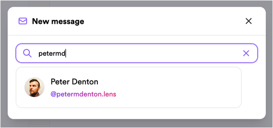
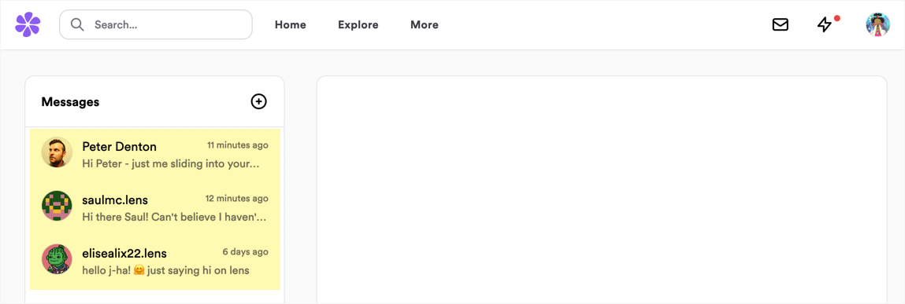

import Tabs from "@theme/Tabs";
import TabItem from "@theme/TabItem";

# Build Lens multi-profile chat with XMTP

When building with XMTP, a conversation comprises a set of messages exchanged between two participants. These participants are identified solely through their wallet addresses.

Web3 is founded on values such as decentralization, portability and ownership. These principles allow users to maintain multiple pseudonymous identities. The idea is that users should be able to possess multiple identities, switch between them as they please, display varying information, and interact with different individuals.

### Lens Profiles

In the context of the Lens Protocol, each identity is represented as a Profile NFT. Given that the core values of Lens are permissionless and portable, you can hold multiple profiles or identities and use them across different applications and platforms.

:::info Default Profile

Because an address can hold multiple profiles and there are address-based interactions such as follow or collect, the default profile variable allows the owner to select one profile as their default. This functionality gives interfaces the ability to shape how such interactions are displayed based on the default profile, rather than just an address. [Read more](https://docs.lens.xyz/docs/get-default-profile)
:::

### Start a conversation with a Lens profile

When building with XMTP, you must provide a way to start a conversation between the user and the wallet address they want to message.

For a Lens app, you want to enable the user to start a conversation with a Lens profile only.

Here is the **New message** modal in Lenster, providing a field where users can search for the Lens profile they want to message:



1. Set the Lens domain prefix to `lens.dev/dm`
2. Construct the conversation ID based on profile pairs

```ts
const PREFIX = "lens.dev/dm";
const buildConversationId = (profileIdA: string, profileIdB: string) => {
  const profileIdAParsed = parseInt(profileIdA, 16);
  const profileIdBParsed = parseInt(profileIdB, 16);

  return profileIdAParsed < profileIdBParsed
    ? `${PREFIX}/${profileIdA}-${profileIdB}`
    : `${PREFIX}/${profileIdB}-${profileIdA}`;
};
```

3. Create the conversation with the newly created `conversationId`

:::caution Important

Building multi profile experiences is optional. Allowing users to have the different conversations with multiple profiles can make the experience inconsistent outside the Lens ecosystem.
:::

You can assign a conversation ID to conversations and then use the ID to filter and organize conversations as needed. You set the `conversationId` when your app creates a conversation.

<Tabs>
<TabItem value="js" label="JS" default>

```tsx
const conversation = await client.conversations.newConversation(
  otherProfile.ownedBy,
  {
    conversationId: buildConversationId(myProfile.id, otherProfile.id),
    metadata: {},
  }
);
await conversation.send("gm");
```

</TabItem>
<TabItem value="swift" label="Swift" default>

```swift
let conversation2 = try await client.conversations.newConversation(
with: "0x3F11b27F323b62B159D2642964fa27C46C841897",
  context: .init(conversationID: buildConversationId(myProfile.id, otherProfile.id),
  metadata: ["title": "Bar conversation"]
)
)

```

</TabItem>
<TabItem value="dart" label="Dart" default>

```dart
let conversation1 = try await client.conversations.newConversation(
with: "0x3F11b27F323b62B159D2642964fa27C46C841897",
context: .init(conversationID: buildConversationId(myProfile.id, otherProfile.id))
)
```

</TabItem>
<TabItem value="kotlin" label="Kotlin" default>

```kotlin
val conversation2 = client.conversations.newConversation(
  "0x3F11b27F323b62B159D2642964fa27C46C841897",
  context = InvitationV1ContextBuilder.buildFromConversation(
    conversationID: buildConversationId(myProfile.id, otherProfile.id), metadata = mapOf("title", "Bar conversation"))
)
```

</TabItem>
</Tabs>

## Filter scoped conversations

Now that you've built the Lens DM `conversationId` for your Lens app, your app can use it to filter and organize Lens conversations. For example, you can use the Lens DM conversation ID as a filter to provide a UI in your app that displays Lens conversations only. This section describes how to filter for Lens conversations and then display their message previews.

Here is the **Messages** panel in Lenster using the Lens DM `conversationId` to filter and display a user's Lens conversations only, along with message previews:



**To filter for Lens conversations and then display messages in a conversation:**

1. Filter for Lens conversations only

<Tabs>
<TabItem value="js" label="JS" default>

```tsx
// Filter for Lens conversations with your profile
const myProfileConversations = lensConversations.filter((conversation) =>
  conversation.context?.conversationId.includes(myProfile.id)
);
```

</TabItem>
<TabItem value="swift" label="Swift" default>

```swift
// Get all the conversations
let conversations = try await client.conversations.list()

// Filter for the ones from your app
let myAppConversations = conversations.filter {
  guard let conversationID = $0.context?.conversationID else {
    return false
  }

  return conversationID.hasPrefix("lens.dev/dm/")
}

```

</TabItem>
<TabItem value="dart" label="Dart" default>

```dart
// Get all the conversations
var conversations = await client.listConversations();
var myConversations = conversations.where((c) =>
  c.conversationId.startsWith("lens.dev/dm/"));
```

</TabItem>
<TabItem value="kotlin" label="Kotlin" default>

```kotlin
// Get all the conversations
val conversations = client.conversations.list()

// Filter for the ones from your app
val myAppConversations = conversations.filter {
    val conversationId = it.context?.conversationId ?: return@filter false
    conversationId.startsWith("lens.dev/dm/")
}

```

</TabItem>
</Tabs>

2. Get the Lens profileIds from each conversationId

```tsx
const conversationKeys = myProfileConversations.map((convo) =>
  buildConversationKey(
    convo.peerAddress,
    convo.context?.conversationId as string
  )
);
const profileIds = conversationKeys.map((key) => getProfileFromKey(key));
```

The result is used to show information about the user and to verify that the profile is still owned by the account associated with the conversation.

```ts
/** Get the Lens profileIds from each conversationId and map them to the
conversation peerAddress. This allows us to ensure the profile still belongs
to the person in the conversation since profiles can be transferred. */
const conversationKeys = myProfileConversations.map((convo) =>
  buildConversationKey(
    convo.peerAddress,
    convo.context?.conversationId as string
  )
);
const profileIds = conversationKeys.map((key) => getProfileFromKey(key));
```

3. Query the Lens API for profile information

```jsx
const [messageProfiles, setMessageProfiles] = useState<Map<string, Profile>>()
const getProfiles = gql`
  query GetProfiles($profileIds: [String]) {
    profiles(request: { profileIds: $profileIds }) {
      items {
        id
        ownedBy
        # Optionally add more profile information here
      }
    }
  }
`
```

4.  Get all messages associated to the profile

```tsx
const fetchProfiles = async () => {
  const response = await apolloClient.query({
    query: getProfiles,
    variables: { profileIds },
  });
  const profiles = response.data.profiles.items as Profile[];
  const newMessageProfiles = new Map(messageProfiles);
  for (const profile of profiles) {
    const peerAddress = profile.ownedBy as string;
    const key = buildConversationKey(
      peerAddress,
      buildConversationId(myProfile.id, profile.id)
    );
    newMessageProfiles.set(key, profile);
  }
  setMessageProfiles(newMessageProfiles);
};
fetchProfiles();
```

## Lenster

To see how starting a conversation with a Lens profile is implemented in Lenster, see [`createNewConversation`](https://github.com/lensterxyz/lenster/blob/3596386dfd0fac3d4297ebe98885e8d79fcda311/src/components/utils/hooks/useGetConversation.tsx#L30) in `/src/components/utils/hooks/useGetConversation.tsx` in the Lenster GitHub repo.

To see how Lenster uses the Lens DM conversationId to filter conversations, see [`listConversations`](https://github.com/lensterxyz/lenster/blob/c64636cbbc688aa118ad886f31316b0150d87916/src/components/utils/hooks/useMessagePreviews.tsx#L106) in `/src/components/utils/hooks/useMessagePreviews.tsx` in the Lenster GitHub repo.

To view the `getProfileFromKey` helper method, see [getProfileFromKey](https://github.com/lensterxyz/lenster/blob/c64636cbbc688aa118ad886f31316b0150d87916/src/components/utils/hooks/useMessagePreviews.tsx#L39) in `src/components/utils/hooks/useMessagePreviews.tsx` in the Lenster GitHub repo.

To see how Lenster implemented `buildConversationKey`, see [buildConversationKey](https://github.com/lensterxyz/lenster/blob/63db97b2ed2e4b20e8fedacb3de472c8f85bb165/src/lib/conversationKey.ts#L5) in `src/lib/conversationKey.ts` in the Lenster GitHub repo.
