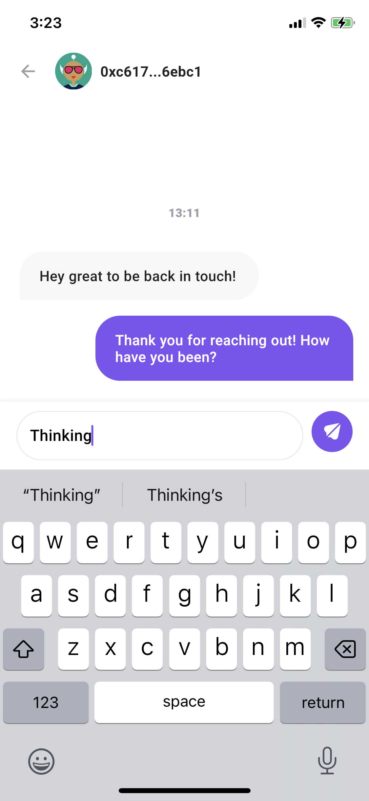

# Start messaging with XMTP

XMTP is an open protocol and network for secure web3 messaging. 

Developers build with [XMTP client SDKs](/sdks-and-tools) to provide messaging in their apps. The XMTP messaging API client takes care of:

- [Authentication](/docs/dev-concepts/account-signatures) using an **XMTP identity that you own and control**
- [End-to-end encryption](/docs/dev-concepts/invitation-and-message-encryption) of **messages that you own and control**
- Providing an **[interoperable inbox](/docs/dev-concepts/interoperable-inbox)** accessible across apps built with XMTP
- Relaying messages to the **progressively decentralized** [XMTP network](/docs/dev-concepts/architectural-overview#network-layer)

A great way to start learning how to build an app with XMTP is to use one!

**To start messaging with XMTP:**

1. **Pick the identity** you want to use to message with XMTP.

    You can use an Ethereum address to start.
    
    If you have an [ENS name](https://ens.domains/) or [Lens handle](https://claim.lens.xyz/) associated with the address, you can tell people to use it to message you instead of using your full Ethereum address.

    Don’t have an Ethereum address? [Create a MetaMask wallet](https://metamask.io/) to get one.

2. **Pick an app.**

   - [Converse](https://getconverse.app/) (iOS): Works with Ethereum addresses, ENS names, and Lens handles
   - [XMTP Inbox](https://xmtp.chat/) (web): Works with Ethereum addresses and ENS names
   - [Buttrfly](https://buttrfly.app/) (iOS): Works with Lens handles
   - [Lenster](https://lenster.xyz/) (web): Works with Lens handles
   - [Orb](https://orb.ac/) (ios and Android): Works with Lens handles

3. **Send a message.**

   To send a message to an address, it must have an XMTP identity already created on the network. Share this page with someone you want to message to help them get on the network. In the meantime, need someone to message? Try one of these addresses. The reply may not be instantaneous because these aren't 🤖🤖🤖.
   - `hi.xmtp.eth`: An XMTP Labs team member will send you a message back.
   - `yashluna.eth`: Product manager at XMTP Labs
   - ???

4. **Want to see the [interoperable inbox](/docs/dev-concepts/interoperable-inbox) in action?**
  
   Try a second app and see all of your conversations in both apps, regardless of the app you used to start them. This also means that you and a friend can each use your own preferred app to exchange messages.
    
   With XMTP, you own and control your messages and are always free to use the app that best suits your needs.
    
   | Your friend using the [Converse app](https://getconverse.app/) to message you on the Orb app | You using the [Orb app](https://orb.ac/) to message your friend on the Converse app |
   |:-------------------------|:-------------------------|
   |  | |

Ready to start building with XMTP? Check out some of these developer resources:

- [Quickstart for the XMTP client SDK for JavaScript](quickstart)
- [SDKs and tools](/sdks-and-tools)
- [Built with XMTP](https://www.notion.so/Own-and-control-your-messages-19532aab75d8430581114cc8bf969ab2): Explore a showcase of apps built with XMTP
- [Awesome XMTP](https://github.com/xmtp/awesome-xmtp): A list of projects building with XMTP
- [FAQ about XMTP](/docs/dev-concepts/faq)
