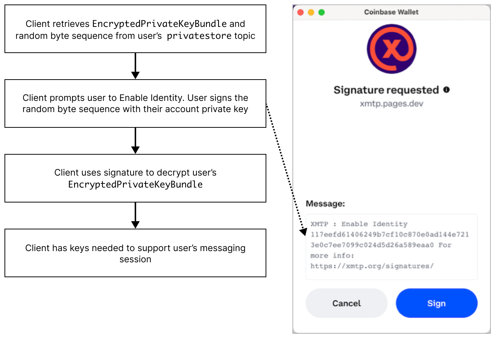

# Blockchain account authentication with XMTP

<!--Kind of going out on a limb - but I changed the title to "Blockchain account authentication" based on this definition - "Topics have participants, but not users. Client apps and the XMTP network have users, but not participants. I think these relationship we are establishing using keys are not about participants. More like users - but more specifically, their blockchain accounts, yes?-->

The XMTP client SDK enables client apps to establish secure, unfalsifiable relationships between app users' blockchain accounts (accounts) such that only the sender and recipient can decrypt messages sent between them.

These relationships are established by authenticating a user's blockchain account using the keys described here.

<!--To learn more about keys, see Keys in The XMTP Protocol specifications.-->

## Identity keys

A client generates the following identity keys:

- `IdentityPublicKey` (XMTP identity)
- `IdentityPrivateKey`

Because XMTP cannot (and should not) access the actual blockchain account keys, a client generates `IdentityPrivateKey` and `IdentityPublicKey` to serve as proxies for a user's blockchain account keys.

The client prompts the user to sign the `IdentityPublicKey`, their XMTP identity, with their blockchain account keys to confirm, or prove, that they generated the XMTP identity.

Anyone can verify the user's signature and consider it as an attestation that the `IdentityPublicKey` is the user's true proxy keys since only the user's blockchain account keys could have created the signature.

## PreKeys

A client also generates public and private PreKeys.

The client prompts the user to sign their public PreKey with their `IdentityPrivateKey`

The PreKeys are used to encrypt invitations and sign encoded messages.

There may be one or more private PreKeys. The client needs to be able to access every private PreKey to decrypt historical messages.

There is always only one public PreKey; the most current PreKey.

## Key generation and retrieval flow

The following diagrams show how an XMTP message API client (client) generates and retrieves identity keys and PreKeys. The diagrams also show details of how the client encrypts and stores keys.

Only client apps authorized by the user can access encrypted keys. By design, XMTP and the XMTP network cannot access these encrypted keys.

To start the flow, a user accesses an app built with XMTP and connects the app to their desired blockchain account (account) using their wallet app. The app then creates a client.

The client checks the XMTP network for keys associated with the account.

If keys don't exist, [the client generates them](#key-generation-flow).

If the keys exist, [the client retrieves them](#key-retrieval-flow).

### Key generation flow

If the client checks the XMTP network for keys associated with the account and the keys don't exist, the client generates them according to this flow.

### Key retrieval flow

If the client checks the XMTP network for keys associated with the account and the keys exist, the client can retrieve them according to this flow. The retrieval flow is not dictated by the XMTP client protocol. Client apps can determine how to best retrieve and store keys after the client has generated the keys. <!--something like this to define that the retrieval flow is not a part of the protocol?-->

