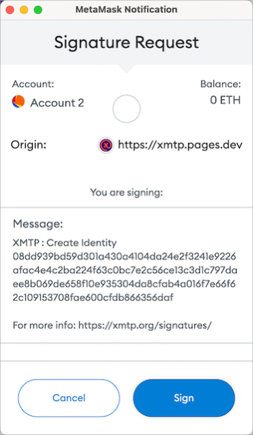
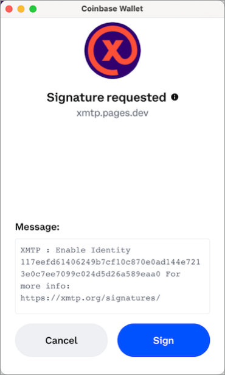

# Sign to send and receive messages using apps built with XMTP

The first time you use an app built with XMTP (Extensible Message Transport Protocol) to send and receive messages using a blockchain account (account), you’re prompted to provide two signatures using your account:

1. [Sign to create an XMTP identity](#sign-to-create-an-xmtp-identity): This is like creating a messaging account associated with your blockchain account.

2. [Sign to enable an XMTP identity](#sign-to-enable-an-xmtp-identity): This is like entering a password to access your messaging account.

Providing these signatures doesn’t cost you any Ether.

Let’s dive deeper into the details of what happens behind the scenes when you provide these signatures.

## Sign to create an XMTP identity

The first time you use an app built with XMTP to send or receive messages, you’re prompted to sign to create a public identity on the XMTP network.

For example, here’s the MetaMask **Signature Request** window that displays when connecting to the XMTP Chat app:

When you click **Sign**, you're creating an **_XMTP identity_**, associated with your account, that you use to send and receive messages on the XMTP network.

More precisely, two things happen:

1. XMTP generates a set of keys that you need to send and receive messages on the XMTP network.

    These keys are XMTP-specific and different from your account keys. XMTP generates the keys as proxies for your account keys because XMTP can’t (and shouldn’t) use your account keys directly.

    These XMTP keys include a public key, which is displayed as a hexadecimal string in the **Message** section of the signature request window.

    This XMTP public key is directly tied to your XMTP identity and is stored and advertised on the XMTP network and provides the information others need to message with you.

    To learn more about these keys, see [Key generation and usage in XMTP](key-generation-and-usage).

2. You sign a message containing your XMTP identity using your account keys.

    This signature establishes a relationship between your XMTP identity and your account and enables anyone to verify that your XMTP identity is authentic and controlled by the account you used to sign it.

Once you’ve successfully signed to create an XMTP identity, you’ll never be prompted to do it again for the same account.

## Sign to enable an XMTP identity

After you’ve signed to create an XMTP identity (first-time only) and anytime you start a new messaging session using an app built with XMTP, you’re prompted to sign to enable your XMTP identity.

For example, here’s the Coinbase Wallet **Signature requested** window that displays when connecting to the XMTP Chat app:

When you click **Sign**, you're providing a secret, like a password, that enables you to access your messages on the XMTP network.

More precisely, you're using your account keys to sign the randomly generated string of bytes shown in the **Message** section of the signature request window. Signing the string generates a secret that only you, as the controller of your account, can generate. By enabling you to sign to generate this secret, XMTP shields you from having to maintain a password.

The first time you sign to enable an XMTP identity, XMTP uses this secret to encrypt your XMTP identity’s private keys and then stores the encrypted keys on the XMTP network.

Subsequently, when you sign to enable an XMTP identity, XMTP fetches your encrypted private keys from the XMTP network and uses this secret to decrypt the keys. These private keys are what enable you to access your messages on the XMTP network.

You’re prompted to sign to enable your XMTP identity any time an app built with XMTP needs to fetch and decrypt your private keys to enable you to access your messages.
